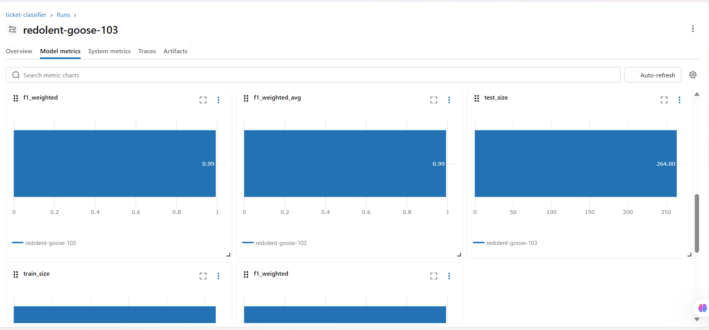

[](https://huggingface.co/akhilaarekal/ticket-classifier)

[](https://ticket-classifier-ep53ybfezntlqbcemxgter.streamlit.app)


# 🎫 Smart Support Ticket Classifier

An LLM-powered IT support ticket classification system using 
sentence-transformers embeddings, production-grade FastAPI, and 
an end-to-end CI/CD pipeline.

---

## 📊 Model Performance

| Metric | Score |
|--------|-------|
| F1 Score (weighted) | **0.9924** |
| Training samples | 1,056 |
| Test samples | 264 |
| Total dataset | 1,320 IT support tickets with class imbalance |
| Categories | 5 |
| Hardware | 360 |
| Software | 279 |
| Network | 233 |
| Security | 237 |
| Account | 211 |
| Embedding model | `sentence-transformers/all-MiniLM-L6-v2` |

> Upgraded from TF-IDF baseline — LLM embeddings capture semantic 
> meaning that keyword matching cannot.

---

## 🔬 Experiment Tracking

MLflow tracks every training run — parameters, metrics, and model artifacts.



Run the dashboard locally:
```bash
mlflow ui
```
Open `http://localhost:5000`

## 🏗️ Architecture

User Request
│
▼
Streamlit UI ──► FastAPI (async) ──► sentence-transformers
│                  (LLM embeddings)
API Key Auth                    │
JSON Logging            LogisticRegression
Request Tracing                 │
│               label + confidence
▼
/health  /predict  /model/info

---

## 🔥 Features

- **LLM Embeddings** — `all-MiniLM-L6-v2` instead of TF-IDF for 
  semantically rich text representations
- **Production API** — Async FastAPI with API key auth, structured 
  JSON logging, per-request tracing IDs
- **Observability** — `/health` endpoint, latency logged on every request
- **CI/CD Pipeline** — GitHub Actions: test → Docker build → smoke test 
  on every push to main
- **Containerised** — Fully Dockerized for reproducible deployment
- **Interactive UI** — Streamlit interface for single and batch predictions

---

## ⚙️ Tech Stack

| Layer | Technology |
|-------|-----------|
| Embeddings | sentence-transformers (all-MiniLM-L6-v2) |
| Classifier | scikit-learn LogisticRegression |
| API | FastAPI, uvicorn, pydantic |
| UI | Streamlit |
| DevOps | Docker, GitHub Actions |
| Language | Python 3.11 |

---

## 🚀 Quick Start

```bash
git clone https://github.com/Akhila854/ticket-classifier.git
cd ticket-classifier
python -m venv venv
venv\Scripts\activate        # Windows
pip install -r requirements.txt

# Train the model
python src/train.py

# Start API (Terminal 1)
uvicorn src.main:app --reload --port 8080

# Launch UI (Terminal 2)
streamlit run src/app.py
```

---

## 🔌 API Endpoints

| Endpoint | Method | Auth | Description |
|----------|--------|------|-------------|
| `/health` | GET | No | Health + model status |
| `/predict` | POST | Yes | Classify a ticket |
| `/model/info` | GET | Yes | Model metrics |

**Request:**
```json
POST /predict
X-API-Key: dev-secret-key-change-in-prod

{ "text": "My laptop screen is broken and won't turn on" }
```

**Response:**
```json
{
  "label": "Hardware",
  "confidence": 0.913,
  "request_id": "8c6363e7"
}
```

---

## 🧪 Tests

```bash
pytest tests/ -v           # API tests (3 tests)
pytest src/test_model.py -v  # Model unit tests (5 tests)
```

---

## 🐳 Docker

```bash
docker build -t ticket-classifier .
docker run -p 8080:8080 ticket-classifier
```

---

## 📁 Project Structure

```
ticket-classifier/
├── .github/
│   └── workflows/
│       └── ci.yml          # GitHub Actions CI/CD
├── src/
│   ├── main.py             # FastAPI app
│   ├── model.py            # TicketClassifier (LLM embeddings)
│   ├── train.py            # Training script
│   ├── test_model.py       # Model unit tests
│   └── app.py              # Streamlit UI
├── data/
│   └── data.csv            # 500-row IT support dataset
├── models/                 # Saved model artifacts (generated)
├── tests/
│   └── test_api.py         # API integration tests
├── Dockerfile
├── requirements.txt
└── README.md
```
